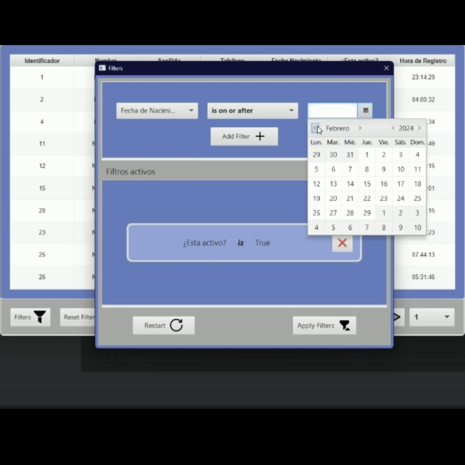

# PaginationFX

It’s a small library for JavaFX applications that allows you to create tables with built-in pagination and customized
filters.

### Supports a Large Number of Elements per Table


### Enables Element Filtering


### Allows Adding One or More Filters Simultaneously and Grouping Them with AND and OR



## Requirements

+ JDK (Java Development Kit): Version 17 or higher. The JDK provides the necessary tools and libraries for Java
  development.
+ JavaFX SDK: Version 17 or higher. JavaFX is a rich client platform for building desktop applications with Java. It
  includes UI controls, graphics, and multimedia support.
+ MySQL Database: currently works exclusively with MySQL databases. However, there are plans to add
  compatibility with other database in the future.
## Usage
To utilize the library, the first step is to ensure that the application's models match the database schema.
Additionally, these models should be annotated with labels that indicate the corresponding database fields:

```java
package models;

public class Usuario {

    @ColumnNameDB(name = "id")
    private long id;

    @ColumnNameDB(name = "name")
    private String nombre;

    @ColumnNameDB(name = "surname")
    private String apellido;

    @ColumnNameDB(name = "email")
    private String correoElectronico;
}
```

```sql
CREATE TABLE user
(
    id      INT AUTO_INCREMENT PRIMARY KEY,
    name    VARCHAR(100) NOT NULL,
    surname VARCHAR(100) NOT NULL,
    email   VARCHAR(100) NOT NULL UNIQUE
);
```

Before adding any tables to our program, we must first establish the connection:

```java
ConnectionMSQL.getInstance("localhost","paginationtest","root","");
```

Next, we initialize a new paginated table by specifying the type of object we are working with and the name of the
database table where the object is stored:

```java
TableViewPaginated<User> NewPaginatedTable = new TableViewPaginated<>(Usuario.class, "user");
```

Then, we'll add the columns we want to display in our table by specifying the column names and the attributes of the
object that will be shown:

```java
NewPaginatedTable.addColumns(Arrays.asList(
    new ColumnPagTable("ID", "id"),
    new ColumnPagTable("Nombre de Usuario","nombre"),
    new ColumnPagTable("Apellido de Usuario","apellido"),
    new ColumnPagTable("Correo Electronico","correoElectronico")
));
```

Finally, simply add the filters you want for your table by specifying the filter name, the object's attribute to be
filtered, and the type of filter to be applied. The available filter types are:

+ **text**: Filters that handle text strings. This allows you to search and filter based on substrings or exact matches
  in text fields.
+ **number**: numeric values, including integers (int), floating-point numbers (float), and long
  integers (long). This type of filter is useful for numeric comparisons and range queries.
+ **date**: allows you to filter records based on specific dates or ranges of dates.
+ **time**: used for filtering records based on specific times or ranges of times.
+ **bool**: allowing you to filter records based on true or false criteria.

```java
NewPaginatedTable.addFilters(Arrays.asList(
    new FilterPagTable("Id de Usuario", "id","number"),
    new FilterPagTable("Nombre de Usuario","nombre","text"),
    new FilterPagTable("Apellido de Usuario","apellido","text"),
    new FilterPagTable("Correo Electronico","correoElectronico","text")
));
```

Finally, after configuring our paginated table, we need to add it to a container in order to display it in our
application:

```java
vboxContainer.getChildren().add(NewPaginatedTable.getPaginationTable());
```

### License

[MIT](LICENSE)
